图表示学习，将节点从高维表示空间映射到低维向量空间，得到表示向量，作用于后续的分类、预测等任务。  
然而在真实场景中，图是动态变化的（或者说流式存在的），因此研究动态图的表示学习是很有必要的，也是近些年的一个热门研究问题。

从动机来说可以分成两类：
* 捕获图演变规律：学习图结构、图特征的动态演变规律
* 图模型高效更新：类似在线学习，图动态变化的过程中得到实时的表示向量

从模型架构来说可以分成两类：
* SkipGram模型
* GNN模型

## 捕获图演变规律

1-4为SkipGram模型，其余为GNN模型。

### 1. Dynamic Network Embedding by Modeling Triadic Closure Process（AAAI 2018）
* 基于三角闭包，通过建模开三角形成闭三角的过程，来刻画演变规律

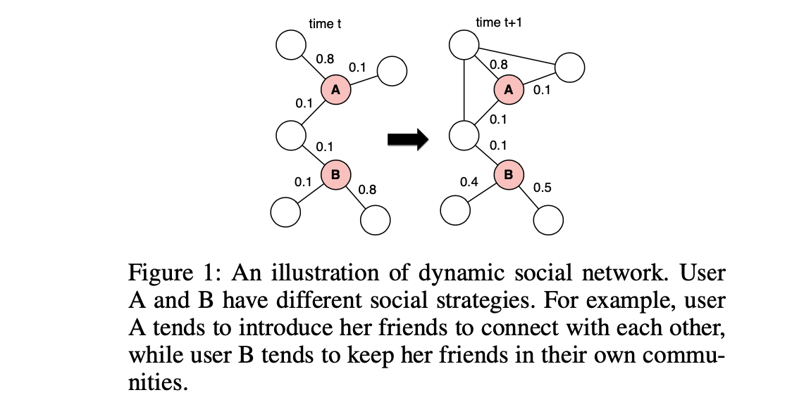

### 2. Embedding Temporal Network via Neighborhood Formation（KDD 2018）
* 基于点过程（Hawkes process），一条边的生成概率由一个基本概率和其他边的影响组成

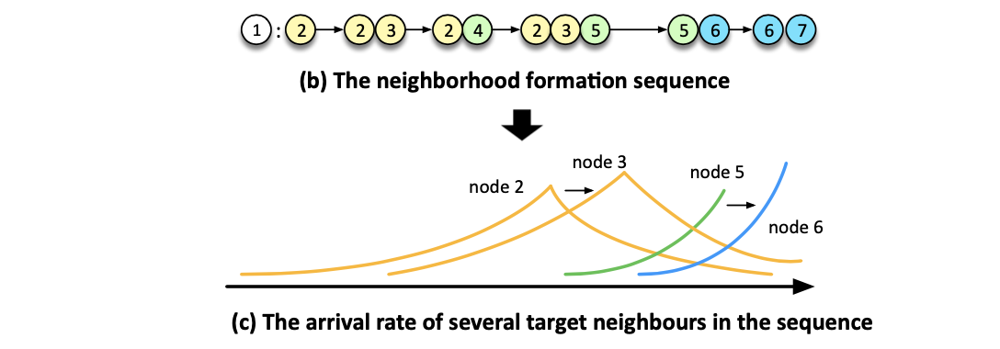

### 3. Learning Dynamic Embeddings from Temporal Interaction Networks
* 基于RNN，jure的没发表的论文，所以没怎么看

### 4. Node Embedding over Temporal Graphs （IJCAI 2019）
* 基于RNN，考虑了时间片之间的旋转问题

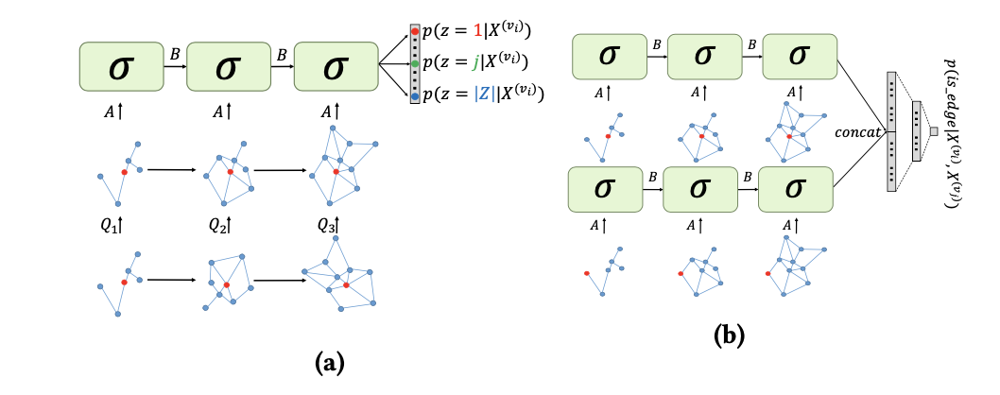

### 5. Dynamic Graph Representation Learning Via Self-Attention Networks（ICLR 2019 Workshop）
* 结构上，利用GAT
* 时间上，所有时间片上得到的表示向量再通过self-attention

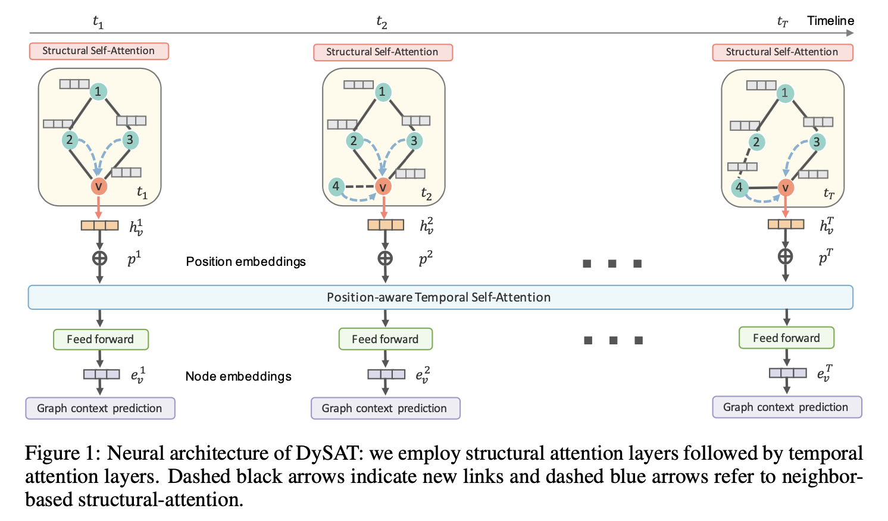

### 6. Learning Dynamic Context Graphs for Predicting Social Events（KDD 2019）
* 任务场景：预测social events
* 结构上，每个时间片训练一个gcn模型
* 时间上，利用一个temporal encoder，捕获上一时刻的信息

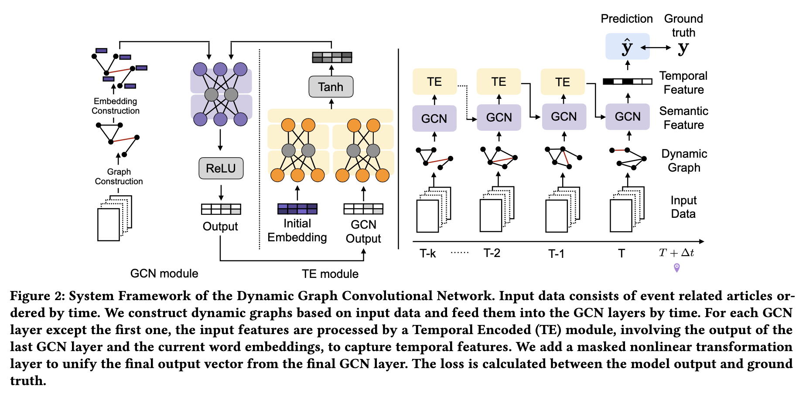

### 7. Recurrent Space-time Graph Neural Networks （NIPS 2019）
* 在gnn聚合的过程中融入了上一时刻的信息，引入gate机制

### 9. Temporal Network Embedding with Micro- and Macro-dynamics（CIKM 2019）
* 从微观（formation process）和宏观（evolution process）两个角度
* 基于点过程建模

### 10. Graph WaveNet for Deep Spatial-Temporal Graph Modeling（IJCAI 2019）
* 任务场景：交通
* 时间上，Gated TCN建模节点输入特征的变化
* 空间上，GCN建模空间信息

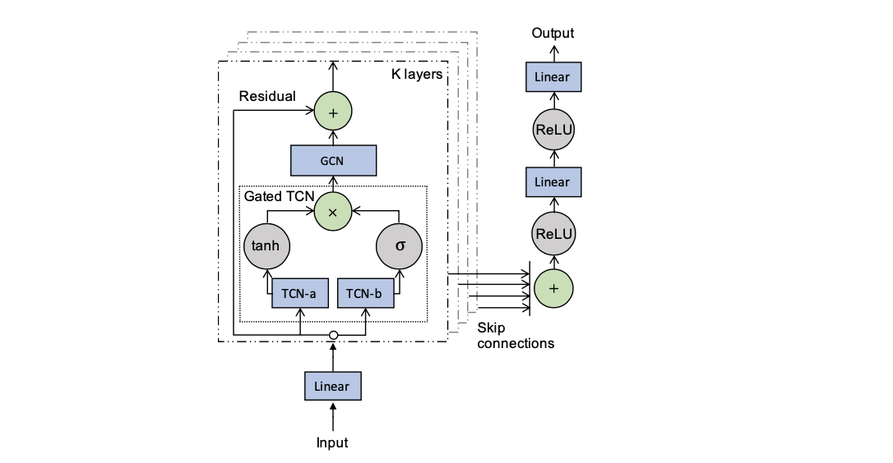

### 11. EvolveGCN: Evolving Graph Convolutional Networks for Dynamic Graphs（AAAI 2020）
* 利用RNN建模每个时间片上GCN模型的参数，适用于更强

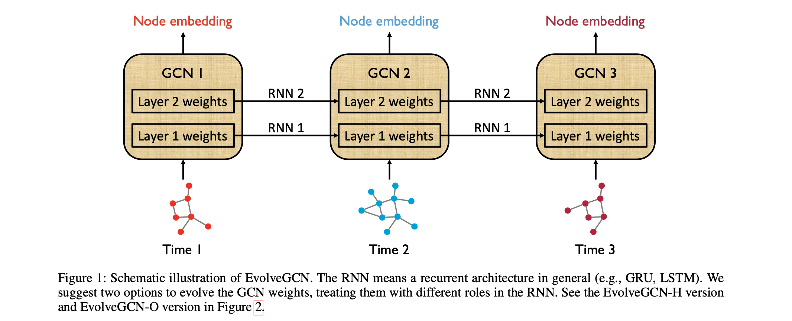

### 12. Streaming Graph Neural Networks（SIGIR 2020）
* update component：先更新新来边的两个顶点
* propogation component：再更新相连的其他顶点
* 借鉴LSTM，引入cell和state保持节点的时序信息，考虑时间间隔

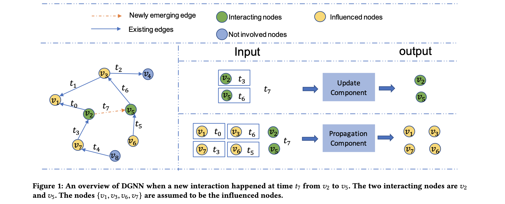

## 图模型高效更新

1-3为SkipGram模型，其余为GNN模型

### 1. Dynamic Network Embedding: An Extended Approach for Skip-gram based Network Embedding（IJCAI 2018）
* 受影响节点的选择：估计表示向量（最优解）的变化情况
* 更新方式：对于受影响节点，重新用Skip-Gram模型训练

### 2. Attributed Network Embedding for Learning in a Dynamic Environment（CIKM 2017）
* offline model：基于谱方法，根据拓扑结构和节点属性得到表示向量
* online model：对表示向量进行在线更新

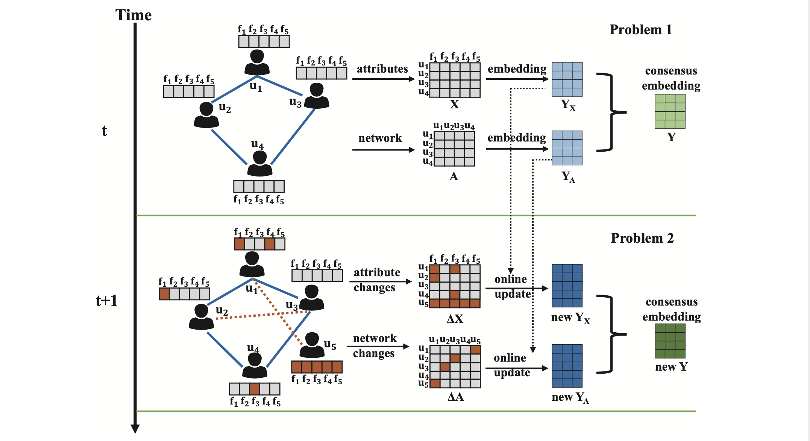

### 3. Real-Time Streaming Graph Embedding Through Local Actions（WWW 2019 Companion）
* 受影响节点的选择：Weighted Independent Cascade Model 
* 更新方式：对于受影响节点，根据规则更新（证明近似方法的解和最优解之间的距离）

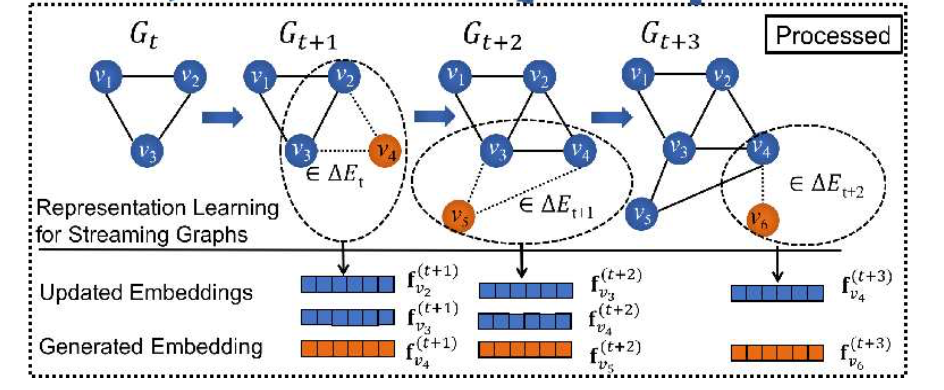

### 4. Streaming Graph Neural Networks via Continual Learning（CIKM 2020）
* 检测并学习图中的新模式，考虑到图数据的关联性
* 保持并巩固已有模式，基于连续学习方法，避免灾难性遗忘

### 5. Disentangle-based Continual Graph Representation Learning（EMNLP 2020）
* 基于解耦的思想：节点的表示是由多个独立的部分组成的，每个部分表达一种语义信息
* 更新时只更新相似语义的邻居

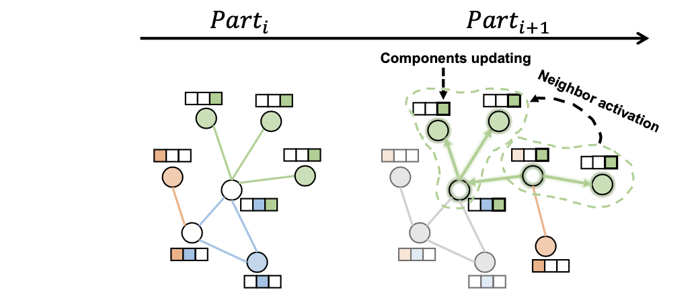

### 6. Continual Graph learning
* Experience Replay GNN，三种experience selection strategy
    * Mean of Feature (MF)：计算每一类的均值（prototype），并找最接近均值的e个点
    * Coverage Maximization (CM)：找到向量空间的最大覆盖集
    * Influence Maximization (MI)：去掉一个节点后最优解的变化情况，近似算法

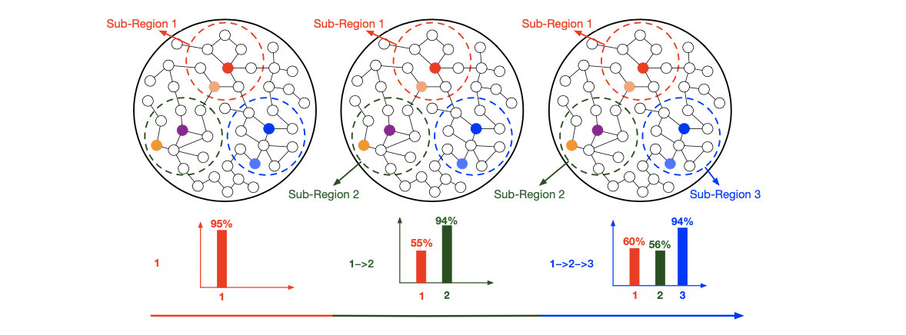

### 7. Lifelong Graph Learning
* feature graph：把关联的节点变成独立的图
* 基于连续学习的replay-based方法

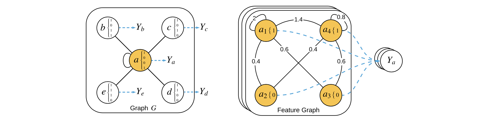