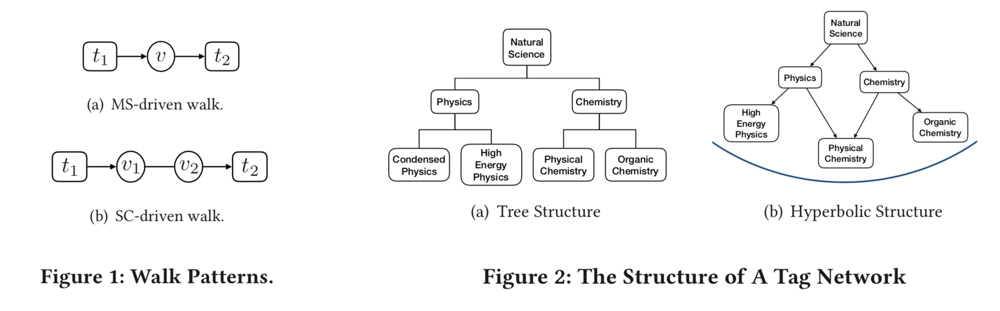
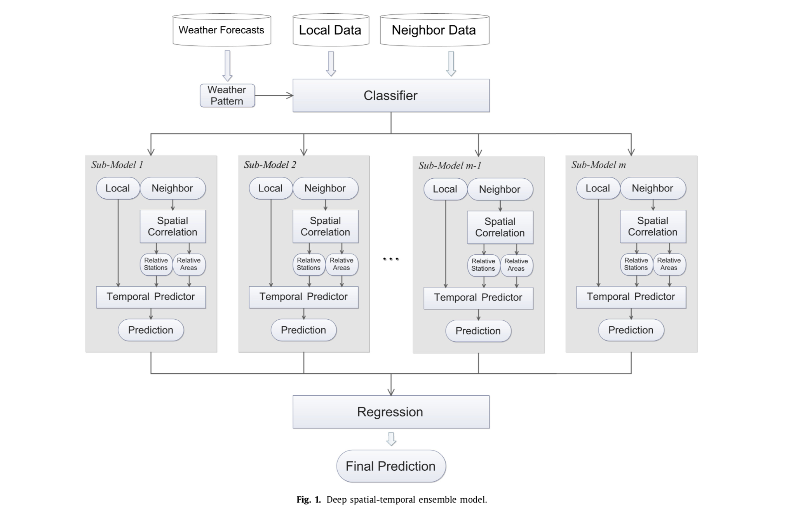

### Streaming Graph Neural Networks via Continual Learning
Graph neural networks (GNNs) have achieved strong performance in various applications. In the real world, network data is usually formed in a streaming fashion. The distributions of patterns that refer to neighborhood information of nodes may shift over time. The GNN model needs to learn the new patterns that cannot yet be captured. But learning incrementally leads to the catastrophic for- getting problem that historical knowledge is overwritten by newly learned knowledge. Therefore, it is important to train GNN model to learn new patterns and maintain existing patterns simultaneously, which few works focus on. In this paper, we propose a streaming GNN model based on a continual learning so that the model is trained incrementally and up-to-date node representations can be obtained at each time step. Firstly, we design an approximation algorithm to detect new coming patterns efficiently based on the information propagation. Secondly, we combine two perspectives of data replaying and model regularization for existing pattern consolidation. Specially, a hierarchy-importance sampling strategy for nodes is designed and a weighted regularization term for GNN parameters is derived, achieving greater stability and generalization of knowledge consolidation. Our model is evaluated on real and synthetic data sets and compared with multiple baselines. The results of node classification prove that our model can efficiently update model parameters and achieve comparable performance to model retraining. In addition, we also conduct a case study on the synthetic data, and carry out some specific analysis for each part of our model, illustrating its ability to learn new knowledge and maintain existing knowledge from different perspectives.

### Learning Node Representations from Noisy Graph Structures
Learning low-dimensional representations on graphs has proved to be effective in various downstream tasks. However, noises prevail in real-world networks, which compromise networks to a large extent in that edges in networks propagate noises through the whole network instead of only the node itself. While existing methods tend to focus on preserving structural properties, the robustness of the learned representations against noises is generally ignored.
In this paper, we propose a novel framework to learn noise- free node representations and eliminate noises simultaneously. Since noises are often unknown on real graphs, we design two generators, namely a graph generator and a noise generator, to identify normal structures and noises in an unsupervised setting. On the one hand, the graph generator serves as a unified scheme to incorporate any useful graph prior knowledge to generate normal structures. We illustrate the generative process with community structures and power-law degree distributions as examples. On the other hand, the noise generator generates graph noises not only satisfying some fundamental properties but also in an adaptive way. Thus, real noises with arbitrary distributions can be handled successfully. Finally, in order to eliminate noises and obtain noise-free node representations, two generators need to be optimized jointly, and through maximum likelihood estimation, we equivalently convert the model into imposing different regularization constraints on the true graph and noises respectively. Our model is evaluated on both real-world and synthetic data. It outperforms other strong baselines for node classification and graph reconstruction tasks, demonstrating its ability to eliminate graph noises.

### EPNE: Evolutionary Pattern Preserving Network Embedding
Information networks are ubiquitous and are ideal for modeling relational data. Networks being sparse and irregular, network embedding algorithms have caught the attention of many re- searchers, who came up with numerous embeddings algorithms in static networks. Yet in real life, networks constantly evolve over time. Hence, evolutionary patterns, namely how nodes develop itself over time, would serve as a powerful complement to static structures in embedding networks, on which relatively few works focus. In this paper, we propose EPNE, a temporal network embedding model pre- serving evolutionary patterns of the local structure of nodes. In particular, we analyze evolutionary patterns with and without periodic- ity and design strategies correspondingly to model such patterns in time-frequency domains based on causal convolutions. In addition, we propose a temporal objective function which is optimized simultaneously with proximity ones such that both temporal and structural information are preserved. With the adequate modeling of temporal information, our model is able to outperform other competitive meth- ods in various prediction tasks.

### Tag2Vec: Learning Tag Representations in Tag Networks
Network embedding is a method to learn low-dimensional representation vectors for nodes in complex networks. In real networks, nodes may have multiple tags but existing methods ignore the abundant semantic and hierarchical information of tags. This in- formation is useful to many network applications and usually very stable. In this paper, we propose a tag representation learning model, Tag2Vec, which mixes nodes and tags into a hybrid network. Firstly, for tag networks, we define semantic distance as the proximity between tags and design a novel strategy, parameterized random walk, to generate context with semantic and hierarchical information of tags adaptively. Then, we propose hyperbolic Skip-gram model to express the complex hierarchical structure better with lower output dimensions. We evaluate our model on the NBER U.S. patent dataset and WordNet dataset. The results show that our model can learn tag representations with rich semantic information and it outperforms other baselines.

### A Deep Spatial-Temporal Ensemble Model for Air Quality Prediction
Air quality has drawn much attention on the recent years because it seriously affects people’s health. Nowadays, people strongly desire air quality prediction, which is a challenging problem as it depends on several complicated factors, such as weather patterns and spatial-temporal dependencies of air quality. In this paper, we design a data-driven approach that utilizes historical air quality and meteorological data to predict air quality in the future. We propose a deep spatial-temporal ensemble(STE) model which is comprised of three components. The first component is an ensemble method to handle different weather patterns. The second one is spatial correlation exploration. The last one is a temporal predictor based on LSTM. We evaluate our model with data from 35 monitoring stations in Beijing, China. The experiments show that each component of our model makes contribution to the improvement in prediction accuracy and the model is superior to baselines.

### Inferring Explicit and Implicit Social Ties Simultaneously in Mobile Social Network
In mobile social network, social tie recognition is a significant task. A great portion of relations are hidden from the interactions in mobile social network. Inferring these implicit social ties can be applied in many aspects like recommender system. But it is challenging because there isn’t any explicit interaction information of these implicit ties in mobile social network. In this paper, we propose a community-based recognition model to infer explicit and implicit social ties simultaneously. Firstly, we observe community features by empirical analysis. It shows that communities with different relation types have different features. Secondly, we propose a communal factor graph to infer social ties. We extract community features, build up a community layer that treats each community as a node. We experiment our model on both implicit and explicit ties and results confirm that using our community features based model can reach a better recognition result.

